# 文件系统管理说明文档

## 项目说明

### 项目简介

本项目在在内存中开辟了一个空间作为文件存储器，利用FAT表和多级目录结构实现了一个简单的文件系统，系统实现了windows的文件资源管理器的部分功能，包括打开文件、删除文件、文件重命名、文件预览、创建文件、创建文件夹、查看文件属性、磁盘格式化、保存修改到磁盘等。

### 项目功能
运行main.py文件后，文件管理系统窗口显示如下：

**本项目实现了以下的功能：**

- **文件预览**
  - 文件目录

    界面左侧以树形结构的方式显示了当前文件管理系统中的所有文件，且文件夹能够展开和合上，用户能够通过该结构对系统中的所有文件进行预览。
  - 文件路径
    窗口的上方显示了当前所在文件的存储位置，方便用户对当前所在位置有直观的了解。

- **文件管理**

  本项目通过显示链接（FAT表）的方法对文件存储空间进行管理，而文件目录采用多级目录结构，每一个文件或文件夹都包括了文件名、物理地址、创建时间、修改时间等信息，且可以通过右键单击查看属性的方式获知。

- **文件操作**

  系统提供了新建文件(夹)、删除文件(夹)、重命名、查看属性、格式化磁盘、修改文件内容并存入磁盘等多种操作。

- **用户友好**

  用户可以通过双击打开文件，也可以右键打开菜单，再单击菜单中的`打开`选项打开文件；可以通过双击文件夹的方式进入下一级目录，也可以通过左侧的多级目录直接跳转到目标文件夹。

### 项目环境

- **开发环境**

  Python 3.9

- **运行方法**
  - 虚拟环境运行  
    打开项目文件夹，先输入  `./venv/Scripts/activate` 进入虚拟环境  
      
    然后输入`python main.py`运行文件即可看到文件管理系统的窗口
  - 非虚拟环境运行
    在终端中打开项目文件夹，先输入`pip install -r requirements.txt`配置项目运行所需依赖项  
      
    然后输入`python main.py`运行文件即可看到文件管理系统的窗口
  
## 功能实现

### 文件管理

在对文件存储空间进行管理的过程中，本项目采用显示链接即FAT表(Fat类)的方式进行管理。FAT表中：-2表示该磁盘块尚未被使用，-1表示该块为该文件磁盘块的最后一块，其他值则指的是下一个磁盘块的位置。

而对于多个文件，本项目通过多级目录结构(CatalogNode类)对每一个文件(FCB类)进行管理，其结构和我们在数据结构课程中所学习过的多叉树结构相同。

在此基础上，本项目完成了以下接口函数：

| 函数            | 功能                   | 截图                                                         |
| --------------- | ---------------------- | ------------------------------------------------------------ |
| openFile()      | 打开文件         | 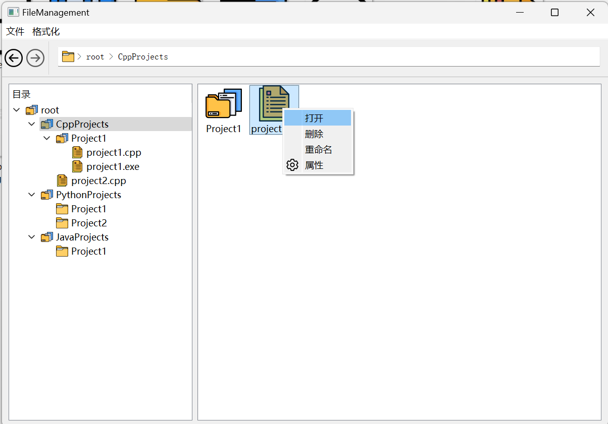</img> |
| deleteFile()    | 删除文件         | 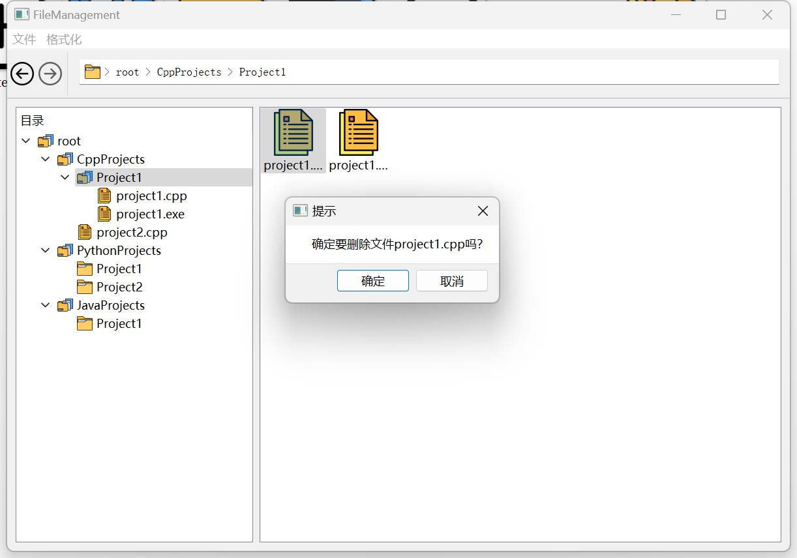</img> |
| rename()        | 修改文件名称     | 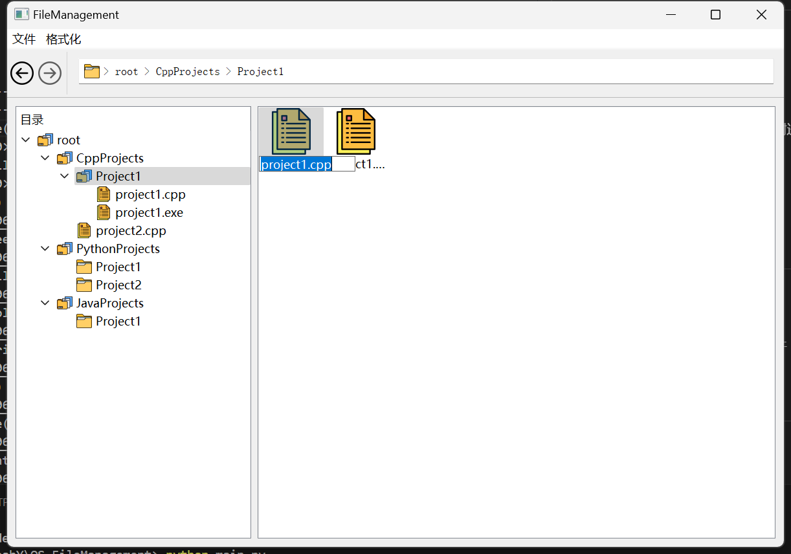</img> |
| clickTreeItem() | 通过目录进行跳转     | 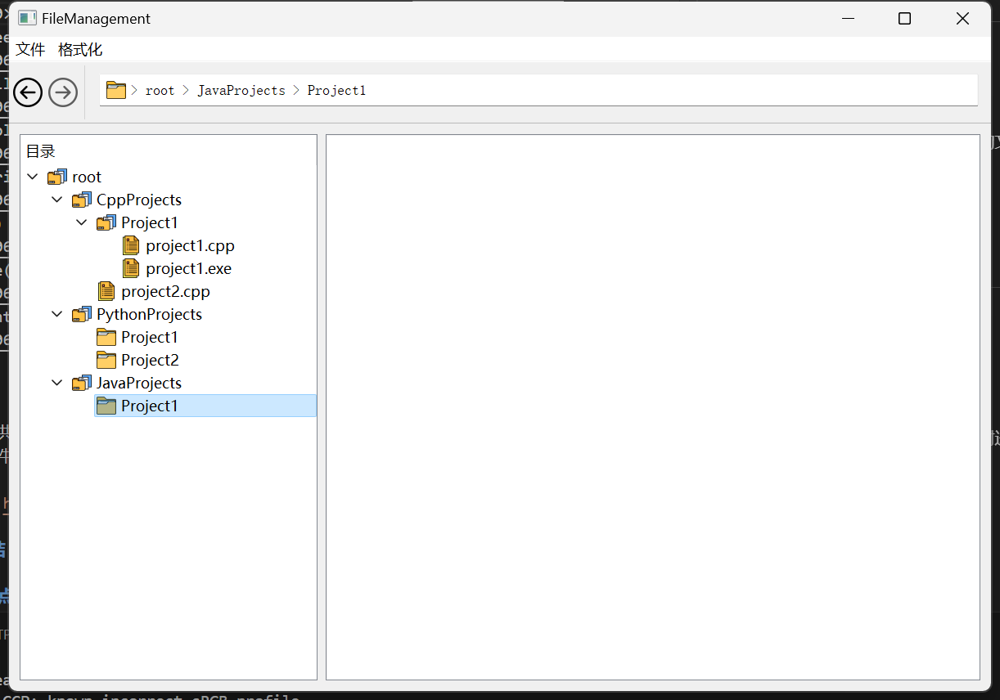 |
| createFile()    | 创建新文件             | 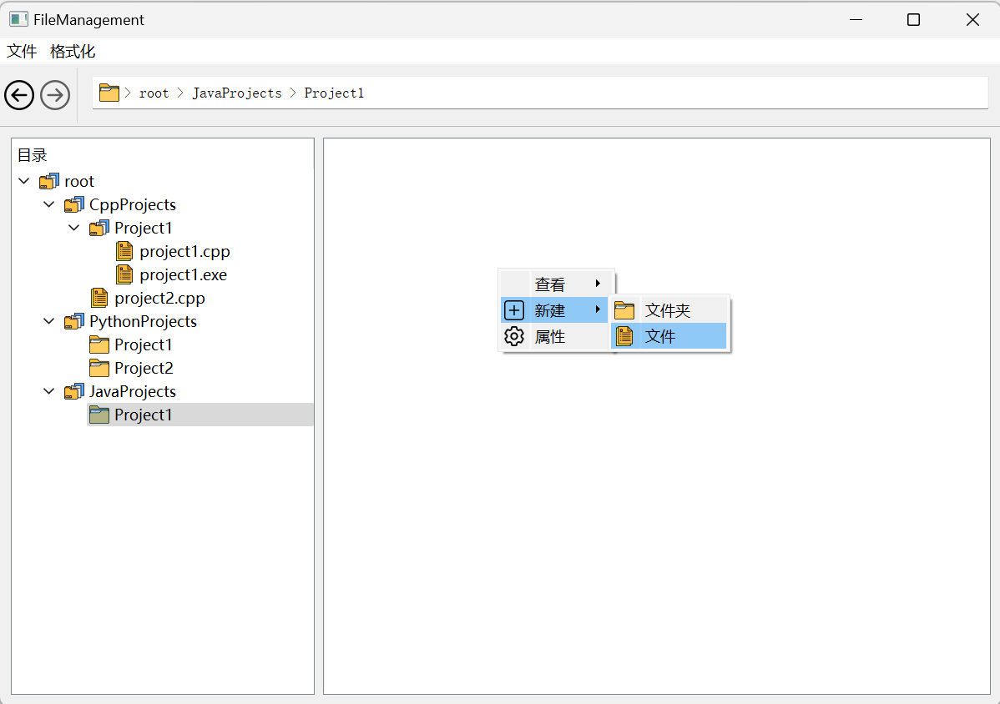 |
| createFolder()  | 创建新文件夹           | 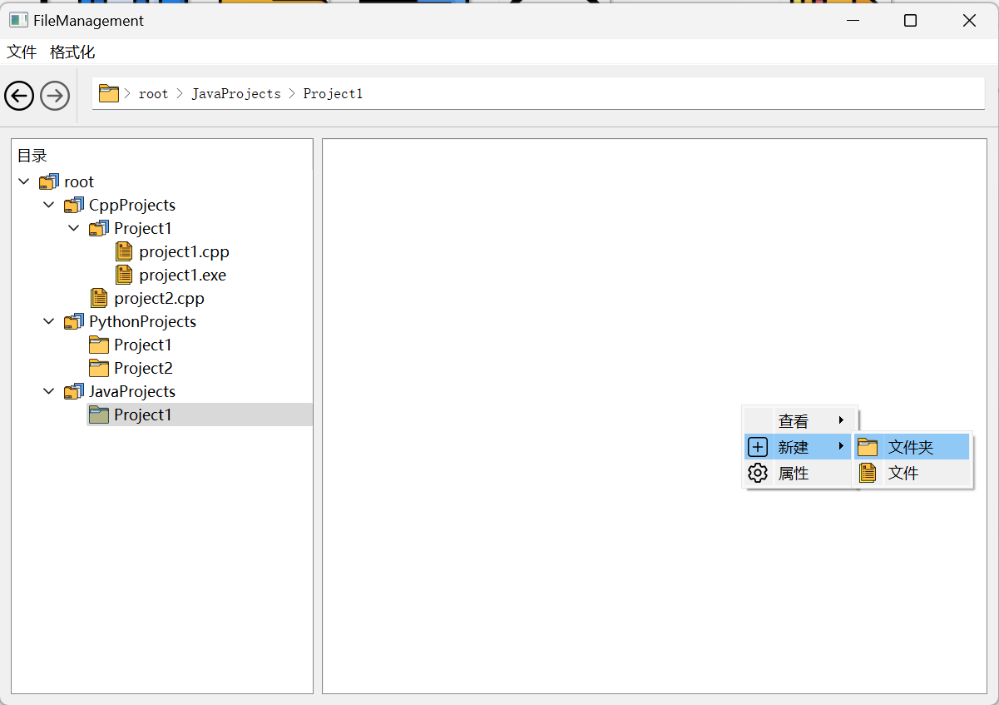 |
| viewAttribute() | 查看文件属性           | 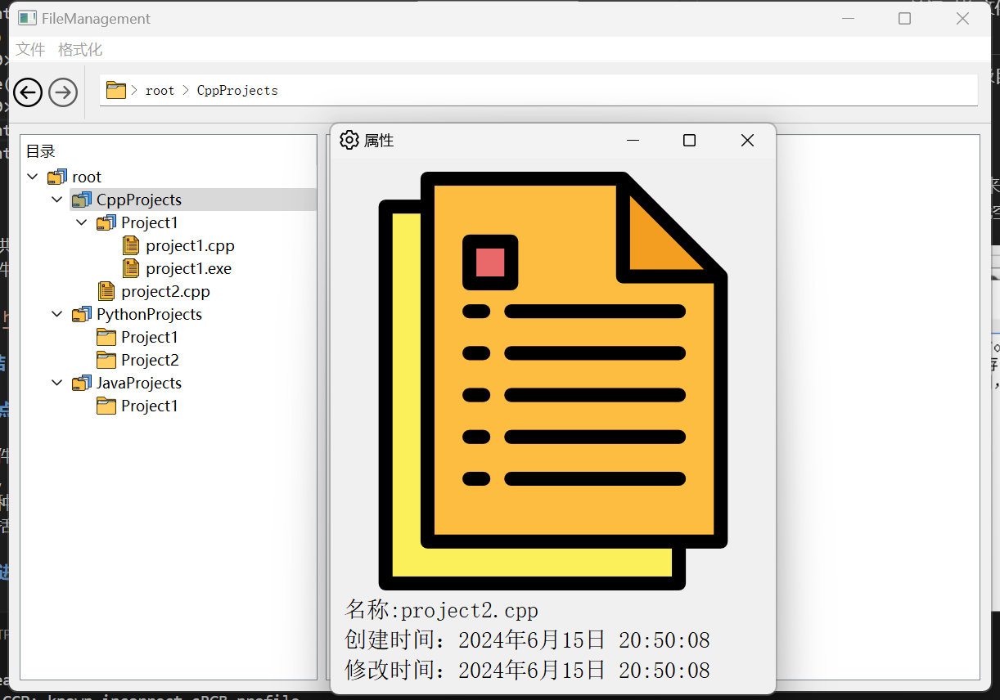 |
| format()        | 磁盘格式化                 | 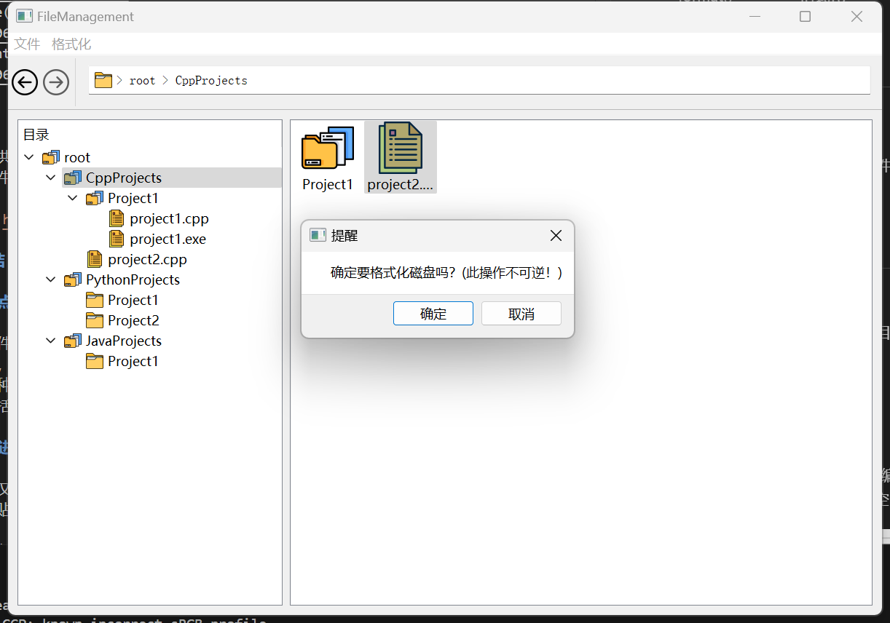 |
| savaFile()      | 将文件更改保存至磁盘 | 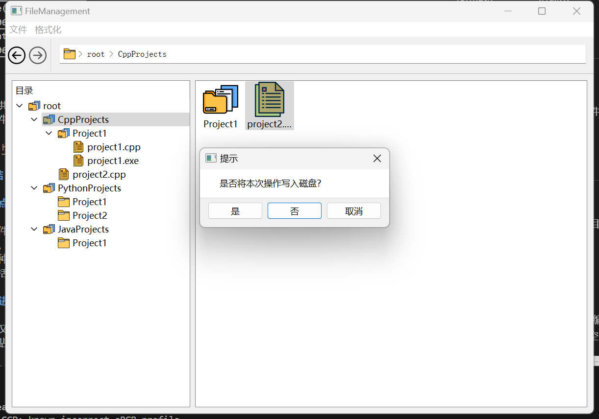 |
| backEvent()     | 返回上一级目录         | 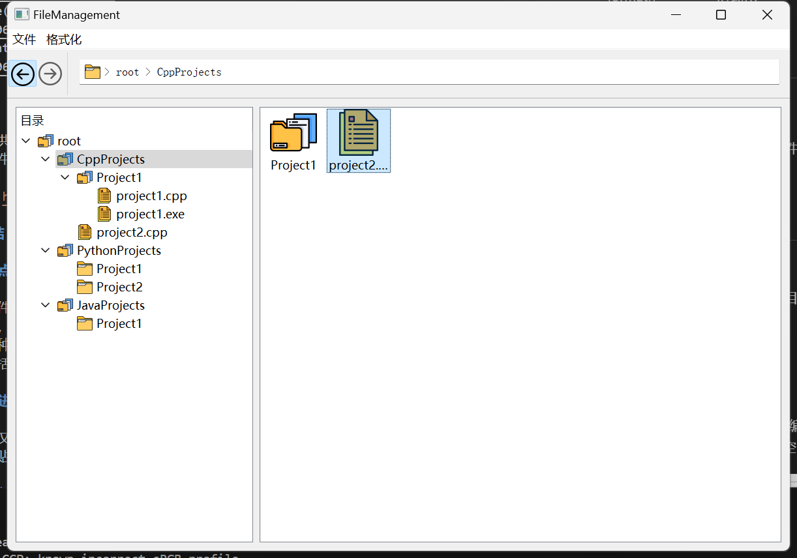 |

### 写文件

本项目还提供了editForm类用来对文件进行，当编辑完成后关闭编辑窗口时会出现询问是否需要保存的提示。如果需要保存，则文件将会在FAT表中寻找空白空间，并写入磁盘块中。

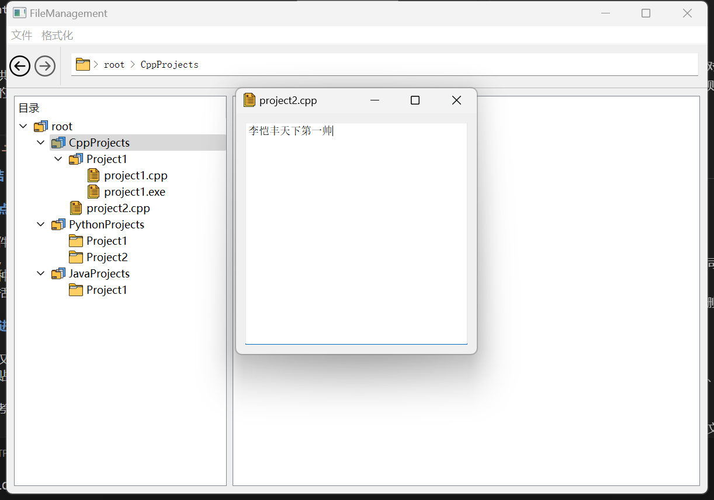
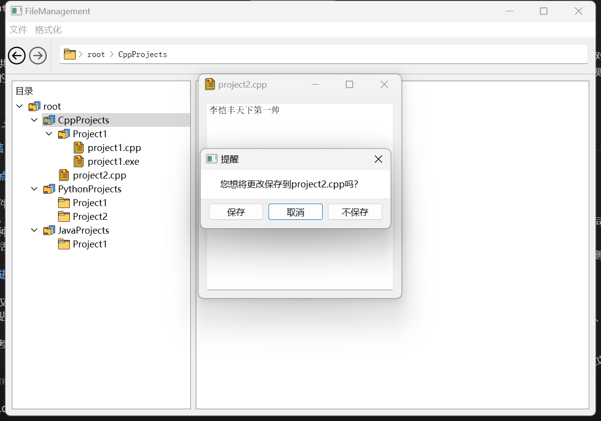

## 总结

### 项目亮点

- 实现了文件管理基本功能，一定程度上复原了windows的文件资源管理器；
- 界面十分美观，使用便捷，文件和文件夹，以及不同类型的文件夹图标各异；
- 提供了多种跳转路径方法，用户体验良好；
- 提供了包括delete在内的多种文件操作快捷键。

### 项目改进方向

- 本项目目前仅仅提供了创建文件、删除文件和修改文件名等基本功能，未来改进可以考虑提供文件复制、粘贴、剪切等高级功能；
- 文件类型比较单一，未来改进可以考虑对不同类型的文件配置不同类型的操作。

同时，可以考虑采用其他结构对文件系统中的磁盘块进行管理。